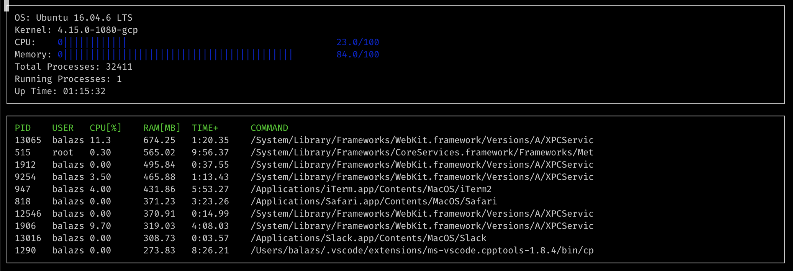

# CppND-System-Monitor

Created by Balázs Szalay

## Important notes

Since my virtual machine could not produce the starting code, I used my local, macOS computer to complete the tasks.

Since there is no `proc` directory on macOS devices, I have saved a `mac` folder, mocking a basic linux root directory. (It is only used `OS`, `kernel`, `Memory`, `Total Processes`, `Running Processes` and `Uptime`.)

The rest of the data (Processes and `CPU`) is generated by using the `ps` and `top` commands.

(Even though I could only test the code on macOS, the code is written so it should run on Linux devices as well, in which case using the proper `proc` folder to generate the above mentioned data - the rest is still generated using the same commands.)

## Instructions

1. Clone the project repository: `git clone https://github.com/udacity/CppND-System-Monitor-Project-Updated.git`

2. Build the project: `make build`

3. Run the resulting executable: `./build/monitor`
   

4. Follow along with the lesson.

5. Implement the `System`, `Process`, and `Processor` classes, as well as functions within the `LinuxParser` namespace.

6. Submit!
